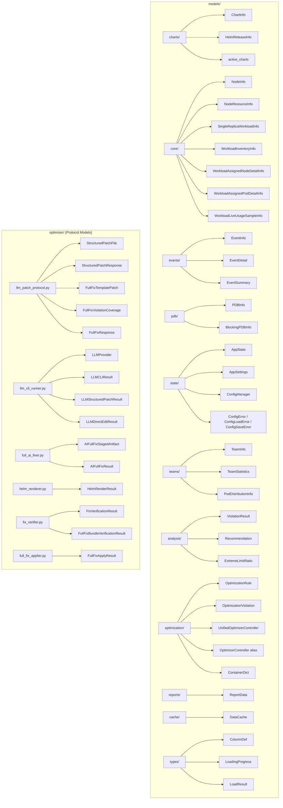
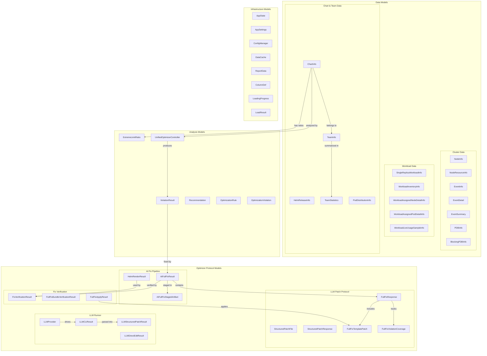
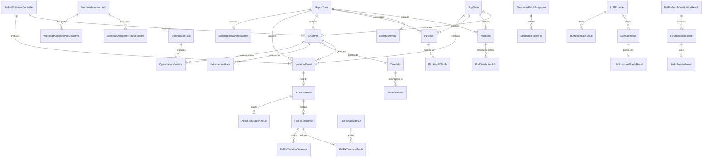
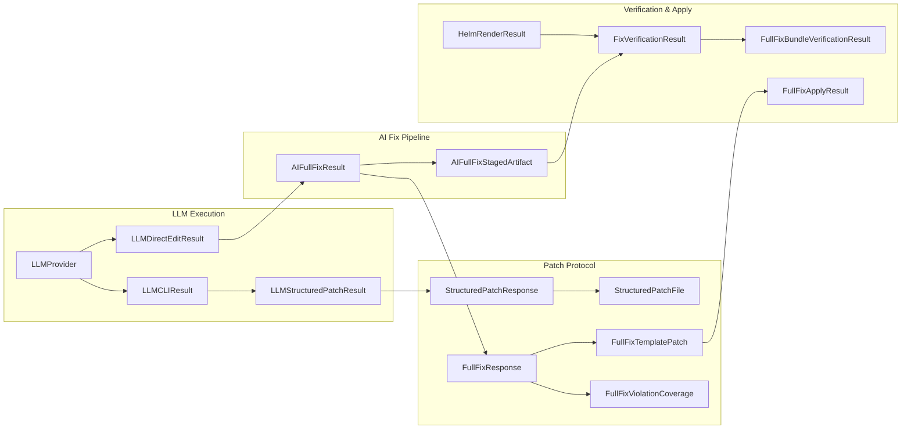

# Model Reference

Complete documentation for data models.

## Model Organization



## Model Category Diagram



## Directory Structure

```
models/
├── __init__.py                        # Public API exports
├── charts/
│   ├── __init__.py
│   ├── chart_info.py                  # ChartInfo, HelmReleaseInfo
│   └── active_charts.py              # load_active_charts_from_file, get_active_charts_set
├── core/
│   ├── __init__.py
│   ├── node_info.py                   # NodeInfo, NodeResourceInfo
│   ├── workload_info.py               # SingleReplicaWorkloadInfo
│   └── workload_inventory_info.py     # WorkloadInventoryInfo, WorkloadAssignedNodeDetailInfo,
│                                      #   WorkloadAssignedPodDetailInfo, WorkloadLiveUsageSampleInfo
├── events/
│   ├── __init__.py
│   ├── event_info.py                  # EventInfo, EventDetail
│   └── event_summary.py              # EventSummary
├── pdb/
│   ├── __init__.py
│   ├── pdb_info.py                    # PDBInfo
│   └── blocking_pdb.py               # BlockingPDBInfo
├── state/
│   ├── __init__.py
│   ├── app_state.py                   # AppState (plain class, NOT BaseModel)
│   ├── app_settings.py                # AppSettings, ConfigError, ConfigLoadError, ConfigSaveError
│   └── config_manager.py             # ConfigManager
├── teams/
│   ├── __init__.py
│   ├── team_info.py                   # TeamInfo
│   ├── team_statistics.py             # TeamStatistics
│   └── distribution.py               # PodDistributionInfo
├── analysis/
│   ├── __init__.py
│   ├── violation.py                   # ViolationResult
│   └── recommendation.py             # Recommendation, ExtremeLimitRatio
├── optimization/
│   ├── __init__.py                    # OptimizationRule, OptimizationViolation,
│   │                                  #   UnifiedOptimizerController, OptimizerController,
│   │                                  #   ContainerDict
│   ├── optimization_rule.py           # OptimizationRule
│   ├── optimization_violation.py      # OptimizationViolation
│   └── optimizer_controller.py        # UnifiedOptimizerController, OptimizerController (alias),
│                                      #   ContainerDict
├── reports/
│   ├── __init__.py
│   └── report_data.py                 # ReportData
├── cache/
│   ├── __init__.py
│   └── data_cache.py                  # DataCache
└── types/
    ├── __init__.py
    ├── columns.py                     # ColumnDef (dataclass)
    └── loading.py                     # LoadingProgress (dataclass), LoadResult (dataclass)

optimizer/                             # Optimizer protocol models (outside models/)
├── llm_patch_protocol.py             # StructuredPatchFile, StructuredPatchResponse,
│                                      #   FullFixTemplatePatch, FullFixViolationCoverage,
│                                      #   FullFixResponse
├── llm_cli_runner.py                 # LLMProvider (Enum), LLMCLIResult, LLMStructuredPatchResult,
│                                      #   LLMDirectEditResult
├── full_ai_fixer.py                  # AIFullFixStagedArtifact, AIFullFixResult
├── helm_renderer.py                  # HelmRenderResult
├── fix_verifier.py                   # FixVerificationResult, FullFixBundleVerificationResult
└── full_fix_applier.py               # FullFixApplyResult
```

## Model Relationships



## Chart Models

### ChartInfo

**Location**: `models/charts/chart_info.py`

Helm chart configuration information.

```python
class ChartInfo(BaseModel):
    """Helm chart configuration information."""

    name: str
    team: str
    values_file: str
    namespace: str | None = None          # From live release or None
    cpu_request: float
    cpu_limit: float
    memory_request: float
    memory_limit: float
    qos_class: QoSClass
    has_liveness: bool
    has_readiness: bool
    has_startup: bool
    has_anti_affinity: bool
    has_topology_spread: bool
    has_topology: bool                     # Alias for has_topology_spread (CLI compat)
    pdb_enabled: bool
    pdb_template_exists: bool
    pdb_min_available: int | None
    pdb_max_unavailable: int | None
    replicas: int | None
    priority_class: str | None
    deployed_values_content: str | None = None  # Raw deployed values (cluster mode)
```

### HelmReleaseInfo

Helm release from cluster.

```python
class HelmReleaseInfo(BaseModel):
    """Represents a Helm release from the cluster."""

    name: str
    namespace: str
    chart: str
    version: str
    app_version: str
    status: str
```

### Active Charts

**Location**: `models/charts/active_charts.py`

Utilities for loading and filtering active chart deployments.

```python
def load_active_charts_from_file(file_path: Path) -> frozenset[str] | None:
    """Load active chart names from a file (one per line)."""

def get_active_charts_set(file_path: Path | None) -> frozenset[str]:
    """Get active charts as a frozenset (empty if file not provided)."""
```

## Core Models

### NodeInfo

**Location**: `models/core/node_info.py`

Basic node information.

```python
class NodeInfo(BaseModel):
    """Basic node information."""

    name: str
    status: NodeStatus
    node_group: str
    instance_type: str
    availability_zone: str
    cpu_allocatable: float                 # In millicores
    memory_allocatable: float              # In bytes
    cpu_requests: float
    memory_requests: float                 # In bytes
    cpu_limits: float
    memory_limits: float                   # In bytes
    pod_count: int
    pod_capacity: int
    # Extended fields for controller methods
    kubelet_version: str = ""
    conditions: dict[str, str] = {}        # condition_type -> status
    taints: list[dict[str, str]] = []      # key, effect, value
```

### NodeResourceInfo

Detailed node resource information with allocation percentages.

```python
class NodeResourceInfo(BaseModel):
    """Detailed node resource information with allocation percentages."""

    name: str
    status: NodeStatus
    node_group: str
    instance_type: str
    availability_zone: str
    kubelet_version: str

    # Allocatable resources
    cpu_allocatable: float                 # In millicores
    memory_allocatable: float              # In bytes
    max_pods: int

    # Current requests/limits (from running pods)
    cpu_requests: float                    # In millicores
    cpu_limits: float                      # In millicores
    memory_requests: float                 # In bytes
    memory_limits: float                   # In bytes

    # Pod count
    pod_count: int

    # Allocation percentages
    cpu_req_pct: float
    cpu_lim_pct: float
    mem_req_pct: float
    mem_lim_pct: float
    pod_pct: float

    # Health status
    is_ready: bool
    is_healthy: bool
    is_cordoned: bool

    # Node conditions and taints
    conditions: dict[str, str]             # condition_type -> status
    taints: list[dict[str, str]]           # key, effect, value
```

### SingleReplicaWorkloadInfo

**Location**: `models/core/workload_info.py`

Single replica workload details.

```python
class SingleReplicaWorkloadInfo(BaseModel):
    """Extended single replica workload information."""

    name: str
    namespace: str
    kind: str                              # Deployment or StatefulSet
    replicas: int
    ready_replicas: int
    helm_release: str | None = None
    chart_name: str | None = None
    status: str = "Unknown"
    is_system_workload: bool = False
    node_name: str | None = None
```

### WorkloadInventoryInfo

**Location**: `models/core/workload_inventory_info.py`

Live Kubernetes workload inventory row for the Workloads tab. This is a comprehensive model with resource utilization, runtime stats, and neighbor pressure metrics.

```python
class WorkloadAssignedNodeDetailInfo(BaseModel):
    """Assigned-node detail for one workload row."""

    node_name: str
    node_group: str = "Unknown"
    workload_pod_count_on_node: int = 0
    node_cpu_req_pct: float | None = None
    node_cpu_lim_pct: float | None = None
    node_mem_req_pct: float | None = None
    node_mem_lim_pct: float | None = None
    node_real_cpu_mcores: float | None = None
    node_real_memory_bytes: float | None = None
    node_real_cpu_pct_of_allocatable: float | None = None
    node_real_memory_pct_of_allocatable: float | None = None
    workload_pod_real_cpu_mcores_on_node: float | None = None
    workload_pod_real_memory_bytes_on_node: float | None = None
    workload_pod_real_cpu_pct_of_node_allocatable: float | None = None
    workload_pod_real_memory_pct_of_node_allocatable: float | None = None


class WorkloadAssignedPodDetailInfo(BaseModel):
    """Assigned-pod detail for one workload row."""

    namespace: str
    pod_name: str
    node_name: str = "-"
    pod_phase: str = "Unknown"
    pod_real_cpu_mcores: float | None = None
    pod_real_memory_bytes: float | None = None
    node_cpu_allocatable_mcores: float | None = None
    node_memory_allocatable_bytes: float | None = None
    pod_cpu_pct_of_node_allocatable: float | None = None
    pod_memory_pct_of_node_allocatable: float | None = None
    restart_reason: str | None = None
    last_exit_code: int | None = None


class WorkloadLiveUsageSampleInfo(BaseModel):
    """Point-in-time workload usage sample for live chart polling."""

    timestamp_epoch: float
    namespace: str
    workload_kind: str
    workload_name: str
    pod_count: int = 0
    node_count: int = 0
    pods_with_metrics: int = 0
    nodes_with_metrics: int = 0
    workload_cpu_mcores: float | None = None
    workload_memory_bytes: float | None = None


class WorkloadInventoryInfo(BaseModel):
    """Live Kubernetes workload inventory row."""

    name: str
    namespace: str
    kind: str                              # Deployment, StatefulSet, DaemonSet, Job, CronJob
    desired_replicas: int | None
    ready_replicas: int | None
    status: str
    helm_release: str | None = None
    managed_by_helm: bool = False
    has_pdb: bool = False
    is_system_workload: bool = False

    # Resource requests/limits
    cpu_request: float = 0.0
    cpu_limit: float = 0.0
    memory_request: float = 0.0
    memory_limit: float = 0.0

    # Node assignment
    assigned_nodes: str = "-"

    # CPU utilization stats (formatted strings)
    cpu_req_util_max: str = "-"
    cpu_req_util_avg: str = "-"
    cpu_req_util_p95: str = "-"
    cpu_lim_util_max: str = "-"
    cpu_lim_util_avg: str = "-"
    cpu_lim_util_p95: str = "-"

    # Memory utilization stats (formatted strings)
    mem_req_util_max: str = "-"
    mem_req_util_avg: str = "-"
    mem_req_util_p95: str = "-"
    mem_lim_util_max: str = "-"
    mem_lim_util_avg: str = "-"
    mem_lim_util_p95: str = "-"

    # Runtime stats
    pod_count: int = 0
    restart_count: int = 0
    restart_reason_counts: dict[str, int] = Field(default_factory=dict)
    # Node real usage stats (formatted strings)
    node_real_cpu_avg: str = "-"
    node_real_cpu_max: str = "-"
    node_real_cpu_p95: str = "-"
    node_real_memory_avg: str = "-"
    node_real_memory_max: str = "-"
    node_real_memory_p95: str = "-"

    # Pod real usage stats (formatted strings)
    pod_real_cpu_avg: str = "-"
    pod_real_cpu_max: str = "-"
    pod_real_cpu_p95: str = "-"
    pod_real_memory_avg: str = "-"
    pod_real_memory_max: str = "-"
    pod_real_memory_p95: str = "-"

    # Detailed node and pod assignment info
    assigned_node_details: list[WorkloadAssignedNodeDetailInfo] = Field(default_factory=list)
    assigned_pod_details: list[WorkloadAssignedPodDetailInfo] = Field(default_factory=list)
```

## Event Models

### EventInfo

**Location**: `models/events/event_info.py`

Individual cluster event.

```python
class EventInfo(BaseModel):
    """Basic event information."""

    type: str                              # Normal, Warning
    reason: str
    message: str
    count: int
    last_timestamp: datetime
    source: str


class EventDetail(BaseModel):
    """Detailed information about a single event."""

    type: str                              # Normal, Warning
    reason: str
    message: str
    count: int
    last_timestamp: str
    source: str
    involved_object: str                   # namespace/name or node name
    severity: str = "INFO"
```

### EventSummary

**Location**: `models/events/event_summary.py`

Cluster event summary.

```python
class EventSummary(BaseModel):
    """Comprehensive event analysis summary for the cluster."""

    total_count: int
    oom_count: int
    node_not_ready_count: int
    failed_scheduling_count: int
    backoff_count: int
    unhealthy_count: int
    failed_mount_count: int
    evicted_count: int
    completed_count: int
    normal_count: int
    recent_events: list[dict[str, str]]    # Last N events with full details
    max_age_hours: float = 1.0
    desired_healthy: int = 0
```

## PDB Models

### PDBInfo

**Location**: `models/pdb/pdb_info.py`

Pod Disruption Budget information.

```python
class PDBInfo(BaseModel):
    """Pod Disruption Budget information."""

    name: str
    namespace: str
    kind: str                              # Deployment, StatefulSet, etc.
    min_available: int | None
    max_unavailable: int | None
    min_unavailable: int | None
    max_available: int | None
    current_healthy: int
    desired_healthy: int
    expected_pods: int
    disruptions_allowed: int
    unhealthy_pod_eviction_policy: str
    selector_match_labels: dict[str, str] | None = None
    # Blocking analysis fields (set by PDBAnalyzer)
    is_blocking: bool = False
    blocking_reason: str | None = None
    conflict_type: str | None = None
```

### BlockingPDBInfo

**Location**: `models/pdb/blocking_pdb.py`

Blocking PDB with analysis details.

```python
class BlockingPDBInfo(BaseModel):
    """Information about a blocking PDB."""

    name: str
    namespace: str
    min_available: int | None = None
    max_unavailable: int | None = None
    unhealthy_policy: str
    expected_pods: int
    disruptions_allowed: int
    issues: list[str]
```

## State Models

### AppState

**Location**: `models/state/app_state.py`

Global application state. Note: this is a plain Python class, NOT a Pydantic BaseModel.

```python
class AppState:
    """Reactive application state container."""

    def __init__(self) -> None:
        # Connection state
        self.cluster_connected: bool = False
        self.charts_path: str = ""

        # Loading state
        self.loading_state: AppStateEnum = AppStateEnum.IDLE
        self.loading_message: str = ""
        self.error_message: str = ""

        # Cluster data
        self.nodes: list[NodeInfo] = []
        self.events: dict[str, int] = {}   # type -> count
        self.pdbs: list[PDBInfo] = []
        self.single_replica_workloads: list[str] = []

        # Charts data
        self.charts: list[ChartInfo] = []
        self.active_filter: str = "all"
        self.search_query: str = ""

        # Optimizer data
        self.violations: list[ViolationResult] = []
        self.violation_count: int = 0

        # UI state
        self.current_screen: str = "cluster"
        self.selected_node: str | None = None
        self.selected_chart: str | None = None

        # Export data
        self.export_data: str = ""
        self.export_path: str = ""
```

### AppSettings

**Location**: `models/state/app_settings.py`

Application configuration including optimizer settings. This IS a Pydantic BaseModel.

```python
class AppSettings(BaseModel):
    """Application settings model with validation."""

    model_config = ConfigDict(populate_by_name=True)

    # Paths
    charts_path: str = ""
    active_charts_path: str = ""
    codeowners_path: str = ""
    export_path: str = "./reports"

    # UI preferences
    theme: str = ThemePreference.DARK      # "dark" or "light"
    refresh_interval: int = 30             # seconds
    auto_refresh: bool = False

    # Cluster mode for Helm analysis
    use_cluster_values: bool = False
    use_cluster_mode: bool = False

    # Event and resource thresholds
    event_age_hours: float = 1.0
    high_cpu_threshold: int = 80
    high_memory_threshold: int = 80
    high_pod_threshold: int = 80
    limit_request_ratio_threshold: float = 2.0
    high_pod_percentage_threshold: int = 80

    # Optimizer settings
    optimizer_analysis_source: str = "auto"       # auto|rendered|values
    verify_fixes_with_render: bool = True
    helm_template_timeout_seconds: int = 30
    ai_fix_llm_provider: str = "codex"            # codex|claude
    ai_fix_codex_model: str = "auto"              # auto|gpt-5.3-codex|...
    ai_fix_claude_model: str = "auto"             # auto|default|sonnet|opus|haiku
    ai_fix_full_fix_system_prompt: str = ""
    ai_fix_bulk_parallelism: int = 2
```

The optimizer settings control how the optimizer module (`kubeagle/optimizer/`) behaves:

| Setting | Default | Description |
|---------|---------|-------------|
| `optimizer_analysis_source` | `"auto"` | Source for analysis: auto, rendered, or values |
| `verify_fixes_with_render` | `True` | Verify fixes by rendering Helm templates |
| `helm_template_timeout_seconds` | `30` | Timeout for helm template rendering |
| `ai_fix_llm_provider` | `"codex"` | LLM provider for AI fixes (codex or claude) |
| `ai_fix_codex_model` | `"auto"` | Codex model to use |
| `ai_fix_claude_model` | `"auto"` | Claude model to use |
| `ai_fix_full_fix_system_prompt` | `""` | Custom system prompt for AI fix generation |
| `ai_fix_bulk_parallelism` | `2` | Number of parallel AI fix operations |

AppSettings also defines exception classes:

```python
class ConfigError(Exception):
    """Base exception for configuration errors."""

class ConfigLoadError(ConfigError):
    """Raised when settings fail to load."""

class ConfigSaveError(ConfigError):
    """Raised when settings fail to save."""
```

### ConfigManager

**Location**: `models/state/config_manager.py`

Manages loading and saving of application configuration to `~/.config/eks-helm-exporter/settings.json`.

```python
class ConfigManager:
    """Manages persistent application settings."""

    SETTINGS_FILENAME = "settings.json"
    APP_NAME = "eks-helm-exporter"

    @classmethod
    def get_config_dir(cls) -> Path: ...
    @classmethod
    def get_config_path(cls) -> Path: ...
    @classmethod
    def load(cls) -> AppSettings: ...
    @classmethod
    def save(cls, settings: AppSettings) -> None: ...
    @classmethod
    def reset(cls) -> AppSettings: ...
```

## Team Models

### TeamInfo

**Location**: `models/teams/team_info.py`

Team information from CODEOWNERS.

```python
class TeamInfo(BaseModel):
    """Represents a team from CODEOWNERS file."""

    name: str
    pattern: str
    owners: list[str]
    team_ref: str | None = None
```

### TeamStatistics

**Location**: `models/teams/team_statistics.py`

Team-level statistics.

```python
class TeamStatistics(BaseModel):
    """Statistics for a team's charts."""

    team_name: str
    chart_count: int

    # Resource totals
    cpu_request: float                     # millicores
    cpu_limit: float                       # millicores
    memory_request: float                  # bytes
    memory_limit: float                    # bytes

    # Average ratios
    avg_cpu_ratio: float
    avg_memory_ratio: float

    # Feature flags (at least one chart has it)
    has_anti_affinity: bool
    has_topology: bool
    has_probes: bool

    # Violations
    violation_count: int
```

### PodDistributionInfo

**Location**: `models/teams/distribution.py`

Pod distribution across nodes.

```python
class PodDistributionInfo(BaseModel):
    """Pod distribution statistics across nodes."""

    total_pods: int
    min_pods_per_node: int
    max_pods_per_node: int
    avg_pods_per_node: float
    p95_pods_per_node: float

    # Nodes with highest pod counts
    high_pod_nodes: list[dict[str, object]]   # name, node_group, pod_count, cpu_pct, mem_pct

    # Distribution by node group
    by_node_group: dict[str, dict[str, object]]
```

## Analysis Models

### ViolationResult

**Location**: `models/analysis/violation.py`

Optimization violation result with fix verification tracking.

```python
class ViolationResult(BaseModel):
    """Represents a violation result from optimization checks."""

    id: str
    chart_name: str
    chart_path: str | None = None
    team: str | None = None
    rule_name: str
    rule_id: str
    category: str                          # resources, probes, availability, security
    severity: Severity
    description: str
    current_value: str
    recommended_value: str
    fix_available: bool
    analysis_source: str = "values"        # values|rendered
    analysis_note: str = ""
    fix_verification_status: str = "not_run"
    fix_verification_note: str = ""
    wiring_suggestions: list[dict[str, str]] = Field(default_factory=list)
```

### Recommendation

**Location**: `models/analysis/recommendation.py`

Actionable recommendation from analysis.

```python
class Recommendation(BaseModel):
    """Actionable recommendation from analysis."""

    id: str
    category: str                          # "eks", "helm", "security", "reliability"
    severity: Severity
    title: str
    description: str
    affected_resources: list[str]          # Chart names, PDB names, etc.
    recommended_action: str
    yaml_example: str | None = None
```

### ExtremeLimitRatio

Extreme limit/request ratio.

```python
class ExtremeLimitRatio(BaseModel):
    """Chart with extreme limit/request ratio."""

    chart_name: str
    team: str

    # CPU
    cpu_request: float                     # millicores
    cpu_limit: float                       # millicores
    cpu_ratio: float

    # Memory
    memory_request: float                  # bytes
    memory_limit: float                    # bytes
    memory_ratio: float

    # The maximum ratio (CPU or memory)
    max_ratio: float
```

## Optimization Models

### OptimizationRule

**Location**: `models/optimization/optimization_rule.py`

Defines an optimization rule used by the optimizer module.

```python
class OptimizationRule(BaseModel):
    """Definition of an optimization rule."""

    id: str                                # e.g. "RES002"
    name: str
    description: str
    severity: str                          # error, warning, info
    category: str                          # resources, probes, availability, security
    check: Callable[[dict], list[OptimizationViolation]]
    fix: Callable[[dict, OptimizationViolation], dict[str, Any] | None] = lambda *_: None
    auto_fixable: bool = False
```

### OptimizationViolation

**Location**: `models/optimization/optimization_violation.py`

A violation detected by the optimizer rules engine.

```python
class OptimizationViolation(BaseModel):
    """Represents a violation of an optimization rule."""

    rule_id: str
    name: str
    description: str
    severity: str                          # error, warning, info
    category: str
    fix_preview: dict[str, Any] | None = None
    auto_fixable: bool = False
```

### UnifiedOptimizerController

**Location**: `models/optimization/optimizer_controller.py`

A Pydantic model (not a controller in the controller layer) that unifies chart data with optimizer analysis results. It bridges between ChartInfo models and the `kubeagle/optimizer/rules.py` rule engine.

```python
class ContainerDict(TypedDict):
    """Type definition for container dict used by optimizer rules."""

    name: str
    livenessProbe: NotRequired[dict[str, Any]]
    readinessProbe: NotRequired[dict[str, Any]]
    startupProbe: NotRequired[dict[str, Any]]


class UnifiedOptimizerController(BaseModel):
    """Unified optimization rules engine."""

    rules: list = RULES
    analysis_source: str = "auto"          # auto|rendered|values
    render_timeout_seconds: int = 30
    max_workers: int = 0

    def check_chart(self, chart: ChartInfo) -> list[ViolationResult]: ...
    def check_all_charts(self, charts: list[ChartInfo]) -> list[ViolationResult]: ...
    def check_all_charts_with_progress(
        self, charts, *, on_chart_done=None
    ) -> list[ViolationResult]: ...
    def generate_fix(
        self, chart, violation,
        ratio_strategy=None, ratio_target=None, probe_settings=None,
    ) -> dict[str, Any] | None: ...


# Backward compatibility alias
OptimizerController = UnifiedOptimizerController
```

## Optimizer Protocol Models

These models live in `kubeagle/optimizer/` (not `models/`) and define the structured contracts for AI-powered fix generation, LLM CLI integration, fix verification, and fix application.

### Optimizer Model Relationships



### StructuredPatchFile

**Location**: `optimizer/llm_patch_protocol.py`

Single file patch payload from LLM output.

```python
class StructuredPatchFile(BaseModel):
    """Single file patch payload."""

    file: str
    purpose: str = ""
    unified_diff: str
```

### StructuredPatchResponse

**Location**: `optimizer/llm_patch_protocol.py`

Normalized patch response from LLM CLI output.

```python
class StructuredPatchResponse(BaseModel):
    """Normalized patch response from LLM CLI output."""

    schema_version: Literal["patch_response.v1"] = "patch_response.v1"
    result: Literal["ok", "no_change", "error"]
    summary: str
    patches: list[StructuredPatchFile] = Field(default_factory=list)
    warnings: list[str] = Field(default_factory=list)
    error: str = ""
```

### FullFixTemplatePatch

**Location**: `optimizer/llm_patch_protocol.py`

Single template patch payload for full-fix response. Must include either `unified_diff` or `updated_content`.

```python
class FullFixTemplatePatch(BaseModel):
    """Single template patch payload for full-fix response."""

    file: str
    purpose: str = ""
    unified_diff: str = ""
    updated_content: str = ""
```

### FullFixViolationCoverage

**Location**: `optimizer/llm_patch_protocol.py`

Per-violation coverage report from chart-bundled full fix.

```python
class FullFixViolationCoverage(BaseModel):
    """Per-violation coverage report from chart-bundled full fix."""

    rule_id: str
    status: Literal["addressed", "unchanged", "not_applicable", "error"] = "addressed"
    note: str = ""
```

### FullFixResponse

**Location**: `optimizer/llm_patch_protocol.py`

Normalized full-fix response from LLM CLI output. Contains values patches, template patches, and per-violation coverage.

```python
class FullFixResponse(BaseModel):
    """Normalized full-fix response from LLM CLI output."""

    schema_version: Literal["full_fix_response.v1"] = "full_fix_response.v1"
    result: Literal["ok", "no_change", "error"]
    summary: str
    values_patch: dict[str, Any] = Field(default_factory=dict)
    template_patches: list[FullFixTemplatePatch] = Field(default_factory=list)
    violation_coverage: list[FullFixViolationCoverage] = Field(default_factory=list)
    warnings: list[str] = Field(default_factory=list)
    error: str = ""
```

### LLMProvider

**Location**: `optimizer/llm_cli_runner.py`

Enum of supported non-interactive CLI providers.

```python
class LLMProvider(str, Enum):
    """Supported non-interactive CLI providers."""

    CODEX = "codex"
    CLAUDE = "claude"
```

### LLMCLIResult

**Location**: `optimizer/llm_cli_runner.py`

Result from a non-interactive LLM CLI execution.

```python
@dataclass(slots=True)
class LLMCLIResult:
    """Result from a non-interactive LLM CLI execution."""

    ok: bool
    provider: LLMProvider
    command: list[str] = field(default_factory=list)
    response_text: str = ""
    stderr: str = ""
    error_message: str = ""
    exit_code: int = 0
```

### LLMStructuredPatchResult

**Location**: `optimizer/llm_cli_runner.py`

Structured patch execution and parsing result combining CLI execution with parsed response.

```python
@dataclass(slots=True)
class LLMStructuredPatchResult:
    """Structured patch execution and parsing result."""

    ok: bool
    provider: LLMProvider
    cli_result: LLMCLIResult
    parsed: StructuredPatchResponse | None = None
    parse_error: str = ""
```

### LLMDirectEditResult

**Location**: `optimizer/llm_cli_runner.py`

Result of provider-driven direct file edits in an existing workspace.

```python
@dataclass(slots=True)
class LLMDirectEditResult:
    """Result of provider-driven direct file edits in an existing workspace."""

    ok: bool
    provider: LLMProvider
    command: list[str] = field(default_factory=list)
    log_text: str = ""
    attempts: int = 1
    changed_rel_paths: list[str] = field(default_factory=list)
    error_message: str = ""
    stdout_tail: str = ""
    stderr_tail: str = ""
```

### AIFullFixStagedArtifact

**Location**: `optimizer/full_ai_fixer.py`

Staged chart workspace produced by direct-edit flow.

```python
@dataclass(slots=True)
class AIFullFixStagedArtifact:
    """Staged chart workspace produced by direct-edit flow."""

    stage_root: Path
    staged_chart_dir: Path
    rel_values_path: str
    changed_rel_paths: list[str] = field(default_factory=list)
    source_hashes: dict[str, str] = field(default_factory=dict)
    provider: str = ""
    execution_log: str = ""
```

### AIFullFixResult

**Location**: `optimizer/full_ai_fixer.py`

Result of AI full-fix generation combining provider output with staged workspace.

```python
@dataclass(slots=True)
class AIFullFixResult:
    """Result of AI full-fix generation."""

    ok: bool
    status: str                                # ok|no_change|error
    provider: str = ""
    prompt: str = ""
    response: FullFixResponse | None = None
    note: str = ""
    tried_providers: list[str] = field(default_factory=list)
    errors: list[str] = field(default_factory=list)
    raw_output_text: str = ""
    staged_artifact: AIFullFixStagedArtifact | None = None
```

### HelmRenderResult

**Location**: `optimizer/helm_renderer.py`

Structured output for helm template execution.

```python
@dataclass(slots=True)
class HelmRenderResult:
    """Structured output for helm template execution."""

    ok: bool
    chart_dir: Path
    values_file: Path
    command: list[str] = field(default_factory=list)
    stdout: str = ""
    stderr: str = ""
    docs: list[dict[str, Any]] = field(default_factory=list)
    error_kind: str = ""
    error_message: str = ""
    parent_only_render_attempted: bool = False
```

### FixVerificationResult

**Location**: `optimizer/fix_verifier.py`

Verification state for a single violation fix action.

```python
@dataclass(slots=True)
class FixVerificationResult:
    """Verification state for a single violation fix action."""

    status: str                                # verified|unresolved|unverified|not_run
    note: str = ""
    before_has_violation: bool | None = None
    after_has_violation: bool | None = None
    suggestions: list[dict[str, str]] = field(default_factory=list)
```

### FullFixBundleVerificationResult

**Location**: `optimizer/fix_verifier.py`

Verification state for chart-level full fix bundle. Contains per-violation results.

```python
@dataclass(slots=True)
class FullFixBundleVerificationResult:
    """Verification state for chart-level full fix bundle."""

    status: str                                # verified|unresolved|unverified|not_run
    note: str = ""
    per_violation: dict[str, FixVerificationResult] = field(default_factory=dict)
```

### FullFixApplyResult

**Location**: `optimizer/full_fix_applier.py`

Result object for full fix atomic apply operations.

```python
@dataclass(slots=True)
class FullFixApplyResult:
    """Result object for full fix atomic apply operations."""

    ok: bool
    status: str                                # ok|error
    note: str = ""
    touched_files: list[str] = field(default_factory=list)
    errors: list[str] = field(default_factory=list)
```

## Report Models

### ReportData

**Location**: `models/reports/report_data.py`

Container for all data needed for report generation.

```python
class ReportData(BaseModel):
    """Container for all data needed for report generation."""

    # Cluster data
    nodes: list[NodeInfo]
    event_summary: EventSummary | None
    pdbs: list[PDBInfo]
    single_replica_workloads: list[SingleReplicaWorkloadInfo]

    # Charts data
    charts: list[ChartInfo]
    violations: list[ViolationResult]

    # Metadata
    cluster_name: str
    context: str | None
    timestamp: str
```

## Cache Models

### DataCache

**Location**: `models/cache/data_cache.py`

TTL-based data caching with automatic invalidation and async locking.

```python
class DataCache:
    """TTL-based data caching with automatic invalidation."""

    TTL_SECONDS = {
        "nodes": 300,
        "pods": 180,
        "events": 60,
        "charts": 600,
        "releases": 120,
    }

    async def get(self, key: str) -> Any: ...
    async def set(self, key: str, data: Any, ttl: int | None = None) -> None: ...
    async def clear(self, key: str | None = None) -> None: ...
```

## Type Models

### ColumnDef

**Location**: `models/types/columns.py`

Column definition for DataTables (dataclass, not Pydantic).

```python
@dataclass
class ColumnDef:
    """Definition for a DataTable column."""

    label: str
    key: str
    formatter: Callable[[Any], str] | None = None
    numeric: bool = False
```

### LoadingProgress and LoadResult

**Location**: `models/types/loading.py`

Progress and result types for async loading operations (dataclasses, not Pydantic).

```python
@dataclass
class LoadingProgress:
    """Progress update for async loading operations."""

    phase: str
    progress: float                        # 0.0 to 1.0
    message: str = ""
    details: dict[str, Any] = field(default_factory=dict)


@dataclass
class LoadResult:
    """Result wrapper for load operations."""

    success: bool
    data: Any | None = None
    error: str | None = None
    duration_ms: float = 0.0
    from_cache: bool = False
```

## Enums

### QoSClass

```python
class QoSClass(str, Enum):
    """Kubernetes QoS class."""

    GUARANTEED = "Guaranteed"
    BURSTABLE = "Burstable"
    BESTEFFORT = "BestEffort"
```

### NodeStatus

```python
class NodeStatus(str, Enum):
    """Node status."""

    READY = "Ready"
    NOT_READY = "NotReady"
    UNKNOWN = "Unknown"
```

### Severity

```python
class Severity(str, Enum):
    """Violation severity."""

    ERROR = "error"
    WARNING = "warning"
    INFO = "info"
```

### AppStateEnum

```python
class AppState(str, Enum):
    """Application loading state."""

    IDLE = "idle"
    LOADING = "loading"
    ERROR = "error"
```

## Usage Examples

### Creating Models

```python
from kubeagle.models import ChartInfo
from kubeagle.constants.enums import QoSClass

chart = ChartInfo(
    name="frontend-api",
    team="Frontend",
    values_file="values.yaml",
    namespace=None,
    cpu_request=100.0,
    cpu_limit=500.0,
    memory_request=128.0,
    memory_limit=512.0,
    qos_class=QoSClass.BURSTABLE,
    has_liveness=True,
    has_readiness=True,
    has_startup=False,
    has_anti_affinity=True,
    has_topology_spread=True,
    has_topology=True,
    pdb_enabled=True,
    pdb_template_exists=True,
    pdb_min_available=1,
    pdb_max_unavailable=None,
    replicas=3,
    priority_class=None,
)
```

### Model Validation

```python
# Pydantic validates on creation
try:
    chart = ChartInfo(
        name="",  # Invalid: empty name
        team="Frontend",
        # ... other fields
    )
except ValidationError as e:
    print(f"Validation error: {e}")
```

### Serialization

```python
# To dict
chart_dict = chart.model_dump()

# To JSON
chart_json = chart.model_dump_json()

# From dict
chart = ChartInfo.model_validate(chart_dict)

# From JSON
chart = ChartInfo.model_validate_json(chart_json)
```

### Using Optimizer Models

```python
from kubeagle.models.optimization import UnifiedOptimizerController

optimizer = UnifiedOptimizerController(
    analysis_source="auto",
    render_timeout_seconds=30,
)

# Check single chart
violations = optimizer.check_chart(chart)

# Check all charts with progress
def on_progress(chart, violations, completed, total):
    print(f"Checked {completed}/{total}: {chart.name}")

all_violations = optimizer.check_all_charts_with_progress(
    charts, on_chart_done=on_progress
)

# Generate fix for a violation
fix = optimizer.generate_fix(chart, violations[0])
```

## Model Quick Reference

| Model | Module | File | Type | Primary Use |
|-------|--------|------|------|-------------|
| `ChartInfo` | charts | `chart_info.py` | BaseModel | Chart configuration |
| `HelmReleaseInfo` | charts | `chart_info.py` | BaseModel | Cluster releases |
| `NodeInfo` | core | `node_info.py` | BaseModel | Basic node data |
| `NodeResourceInfo` | core | `node_info.py` | BaseModel | Detailed node resources |
| `SingleReplicaWorkloadInfo` | core | `workload_info.py` | BaseModel | Single replica workloads |
| `WorkloadInventoryInfo` | core | `workload_inventory_info.py` | BaseModel | Full workload inventory |
| `WorkloadAssignedNodeDetailInfo` | core | `workload_inventory_info.py` | BaseModel | Workload node details |
| `WorkloadAssignedPodDetailInfo` | core | `workload_inventory_info.py` | BaseModel | Workload pod details |
| `WorkloadLiveUsageSampleInfo` | core | `workload_inventory_info.py` | BaseModel | Live usage samples |
| `EventInfo` | events | `event_info.py` | BaseModel | Individual events |
| `EventDetail` | events | `event_info.py` | BaseModel | Event details |
| `EventSummary` | events | `event_summary.py` | BaseModel | Event statistics |
| `PDBInfo` | pdb | `pdb_info.py` | BaseModel | PDB configuration |
| `BlockingPDBInfo` | pdb | `blocking_pdb.py` | BaseModel | Blocking PDB analysis |
| `AppState` | state | `app_state.py` | Plain class | Global app state |
| `AppSettings` | state | `app_settings.py` | BaseModel | App configuration |
| `ConfigManager` | state | `config_manager.py` | Plain class | Config management |
| `TeamInfo` | teams | `team_info.py` | BaseModel | Team from CODEOWNERS |
| `TeamStatistics` | teams | `team_statistics.py` | BaseModel | Team metrics |
| `PodDistributionInfo` | teams | `distribution.py` | BaseModel | Pod distribution |
| `ViolationResult` | analysis | `violation.py` | BaseModel | Optimization violations |
| `Recommendation` | analysis | `recommendation.py` | BaseModel | Actionable recommendations |
| `ExtremeLimitRatio` | analysis | `recommendation.py` | BaseModel | Resource ratios |
| `OptimizationRule` | optimization | `optimization_rule.py` | BaseModel | Optimizer rule definition |
| `OptimizationViolation` | optimization | `optimization_violation.py` | BaseModel | Optimizer rule violation |
| `UnifiedOptimizerController` | optimization | `optimizer_controller.py` | BaseModel | Chart-optimizer bridge |
| `OptimizerController` | optimization | `optimizer_controller.py` | Alias | Backward compat alias |
| `ContainerDict` | optimization | `optimizer_controller.py` | TypedDict | Container type for rules |
| `ReportData` | reports | `report_data.py` | BaseModel | Report export data |
| `DataCache` | cache | `data_cache.py` | Plain class | Data caching |
| `ColumnDef` | types | `columns.py` | dataclass | Column definitions |
| `LoadingProgress` | types | `loading.py` | dataclass | Loading progress |
| `LoadResult` | types | `loading.py` | dataclass | Load result wrapper |
| `StructuredPatchFile` | optimizer | `llm_patch_protocol.py` | BaseModel | Single file patch payload |
| `StructuredPatchResponse` | optimizer | `llm_patch_protocol.py` | BaseModel | LLM patch response |
| `FullFixTemplatePatch` | optimizer | `llm_patch_protocol.py` | BaseModel | Template patch for full fix |
| `FullFixViolationCoverage` | optimizer | `llm_patch_protocol.py` | BaseModel | Per-violation fix coverage |
| `FullFixResponse` | optimizer | `llm_patch_protocol.py` | BaseModel | Full-fix LLM response |
| `LLMProvider` | optimizer | `llm_cli_runner.py` | str Enum | LLM provider (codex/claude) |
| `LLMCLIResult` | optimizer | `llm_cli_runner.py` | dataclass | CLI execution result |
| `LLMStructuredPatchResult` | optimizer | `llm_cli_runner.py` | dataclass | Parsed patch result |
| `LLMDirectEditResult` | optimizer | `llm_cli_runner.py` | dataclass | Direct edit result |
| `AIFullFixStagedArtifact` | optimizer | `full_ai_fixer.py` | dataclass | Staged chart workspace |
| `AIFullFixResult` | optimizer | `full_ai_fixer.py` | dataclass | AI full-fix result |
| `HelmRenderResult` | optimizer | `helm_renderer.py` | dataclass | Helm render output |
| `FixVerificationResult` | optimizer | `fix_verifier.py` | dataclass | Fix verification state |
| `FullFixBundleVerificationResult` | optimizer | `fix_verifier.py` | dataclass | Bundle verification state |
| `FullFixApplyResult` | optimizer | `full_fix_applier.py` | dataclass | Apply operation result |

## Public API Exports (`models/__init__.py`)

All models listed below are importable from `kubeagle.models`:

```python
from kubeagle.models import (
    # Charts
    ChartInfo,
    # Active charts utilities
    get_active_charts_set,
    load_active_charts_from_file,
    # Core
    NodeInfo, NodeResourceInfo,
    SingleReplicaWorkloadInfo,
    WorkloadInventoryInfo,
    # Events
    EventInfo, EventDetail, EventSummary,
    # PDB
    PDBInfo, BlockingPDBInfo,
    # State
    AppState, AppSettings, ConfigManager,
    # Teams
    TeamInfo, TeamStatistics, PodDistributionInfo,
    # Analysis
    ViolationResult, Recommendation, ExtremeLimitRatio,
    # Optimization
    OptimizationRule, OptimizationViolation,
    UnifiedOptimizerController, OptimizerController,
    ContainerDict,
    # Reports
    ReportData,
    # Types
    ColumnDef, LoadingProgress, LoadResult,
)
```

## Cross-References

- [Controller Reference](../controllers/controller-reference.md) - Model usage in controllers
- [Widgets Overview](../widgets/overview.md) - Widget architecture
